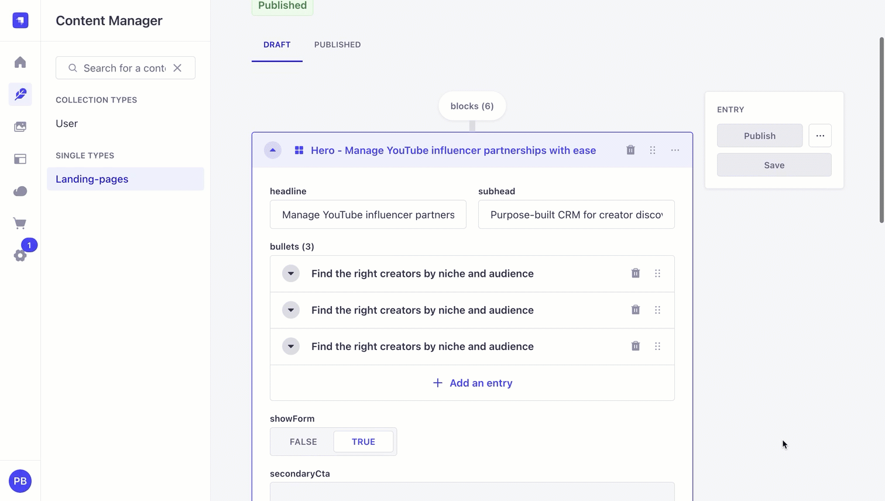

# Building Faster with V0 and Claude Code: Lessons Learned from Vibe Coding

AI tools like Vercel's [V0](https://v0.app) and [Claude Code](https://www.anthropic.com/claude-code) can help you spin up projects faster than ever. But from my experience in vibe coding, I've learned they're not magic bullets—you still need to know what you're building, understand your data, the problems you are trying to solve, and the tech stack you are using to have good output. (And yes—you still need to know how to code.) Especially with these tools.

These tools are powerful, but they're also prone to hallucinations and mistakes. The better you understand your project's architecture and how these tools work, the more effective you'll be.

In this post, I'll share a high-level overview of my process. There's a lot to unpack, so I'll follow up with deeper dives and answer questions in future posts.

Let's get the SEO stuff out of the way. ( I promise I will be quick )

## What is Vibe Coding?

Vibe coding is a chill, creative development session where you use AI tools to prototype and build applications in a flow state.

Instead of the traditional, step-by-step coding from scratch, you describe what you want in natural language and let the AI generate the code, guiding it iteratively.

The “vibe” comes from maintaining momentum and curiosity—trying things out quickly without getting bogged down in setup or syntax issues.

You might start with a blank project, turn on some music, and then feed prompts to an AI assistant to scaffold your app’s UI and functionality.

( I am going to go with this definition )

**Key characteristics of vibe coding include:**

- AI-assisted coding: You use an AI tool (like Vercel v0 or similar) as a pair programmer. The AI can generate React components, pages, styles, and even connect to APIs based on your instructions.
- Rapid prototyping: The goal is to get a working prototype up and running quickly. It’s about turning ideas into working code in minutes or hours, not days, by letting the AI handle the heavy lifting of boilerplate code generation.
- Iterative exploration: You don’t necessarily have a fully specified end product from the start. Instead, you prompt the AI to build one piece at a time, refining and adding features in short cycles.
- This trial-and-error encourages experimentation and creativity.
- Human oversight: Importantly, vibe coding doesn’t mean the AI does everything perfectly. Think of it like working with a Jr. developer ( I mean a tool ), let's not demean JR developers here, we need them, otherwise who is going to become Sr. engineer.
- The AI can produce a lot of code quickly, but you need to review, test, and guide it.

As one developer put it, “It felt a lot like mentoring a very junior developer: you get raw productivity — but you also need to review and guide carefully.”

In other words, the human developer remains responsible for the final quality and correctness of the code. ( At least hope this is a standard )

**What is v0:** ( by Vercel ) A browser-based AI tool that rapidly generates front-end code and user interfaces using natural language or design files, built specifically for Next.js projects.

**What is Claude Code:** ( by Anthropic ) A terminal-based AI coding assistant that acts as an autonomous developer—able to read, write, debug, and execute code across your full-stack project, guided by you.

[ Ok, back to content. ]

When coding with AI, your starting point and end goal should shape your entire approach.

Since we’ll keep this Strapi-specific, here are the first questions I ask before getting started:

- Do you already have a Strapi project?
- Do you already have a Next.js ( Frontend ) project?
- Are you starting completely from scratch?

On the way, we will cover some best practices and patterns that I discovered during this process.

**But first—why did I choose V0 and Claude Code?**

For me, it comes down to keeping a clear separation from my IDE. I want my workflow to be IDE-agnostic, adding a layer of separation that forces me to slow down and think more intentionally about what I'm building.


With Claude Code, I've adopted the agentic coding mindset, treating AI agents as independent contributors, much like a product manager working with a team of developers. This allows me to assign different tasks to multiple agents, enabling them to work in parallel on various parts of the codebase.

V0 is also a perfect fit for the kind of work I do—building with Next.js and shadcn/ui. It's fast, visually focused, and great for iterating on UI ideas.


On top of that, V0 offers an API, which I plan to explore for automating UI creation. And like Claude Code's terminal tabs, V0's multiple browser tabs make it easy to explore and refine multiple concepts in parallel.

This ability to work in parallel is already one of the biggest wins these tools bring to my development process.

## 1. If You Already Have a Strapi Project

If you already have a Strapi project and want to quickly build or prototype a frontend, here’s how I usually approach it.

I tend to work with [Next.js](https://nextjs.org) and [ShadCN UI](https://ui.shadcn.com) (built on top of [Tailwind](https://tailwindcss.com/)), and for this kind of project my go-to tool is [V0](https://v0.app.

We’ll start with a quick overview of the steps I follow, then go over some best practices, common pitfalls, and one critical warning:

**Note:** Never point your AI tools directly at your production database or server. Always use the dev environment.

It’s surprisingly easy to trigger thousands of API requests in seconds and accidentally DDoS yourself—or cause even bigger problems—if you’re not careful.

Of course, I knew better, and it was not something I did.

Steps:

1. Make sure your Strapi API is accessible—locally or via a deployed environment.

I already had a test project that I deployed to [Strapi Cloud](https://strapi.io/cloud).

2. Retrieve and save an example JSON response from your API.

Having the response is a good way to guide the LLM to understand how your data is structure. This approach worked well for me.

3. Use that JSON as context in your prompt to V0 infer correct types and data structure.

I went with "one shot" prompt approach, but way better, would of been to:

- Start with a small scope: have the AI generate a single page (e.g., Articles list) that fetches and displays your data.
- Once the basics work, incrementally add more pages and features.

Here is the prompt I used:

```txt
You are a senior frontend developer experienced with TypeScript, React, Next.js, and building dynamic content-driven websites with Strapi as the backend.

TASK: Build a mock frontend application in TypeScript that consumes the following API response (below under `<resource>`) and renders a blog platform.

TECH: Use the following technologies
- Next.js 15
- Tailwind 4
- ShadCN UI

REQUIREMENTS:
  - Create a blog listing page that displays all articles
  - Each article should show the title, description, author, category, and cover image
  - Include search functionality to filter articles by title or category - Implement pagination to support large datasets
  - Create a single blog article page
  - When a user clicks on a blog post, they are taken to a detailed view using the slug
  - Render all associated blocks (rich-text, quotes, media, sliders) - Each block type should map to a dedicated React component
  - Use an object map or a `switch` statement to select the correct component for each block
  - The application should use clean TypeScript types and structure

  CONSTRAINTS:
  - Use the provided mock API data in `<resource>` to create the types and build all the appropriate componetns
  - Afterwards use fetch to fetch the date from live url: https://inspired-duck-61a6601220.strapiapp.com/api/articles
  - We are using Next.js App Router
  - Design and layout is not important
  — focus on functional logic and clean structure
  - Follow best practices in separating concerns and component design

  DELIVERABLE: Return a full working Blog website, with search and pagination features using TypeScript code example structured as follows:

  1. Type definitions for the API data
  2. Components for each block type
  3. Blog listing component with search and pagination
  4. Single blog article page that renders all content blocks dynamically
  5. A simple mock API client to fetch the data

  <resources>
    Add Json data from your response. I omit it here to save space.
  </resources>
```

Between the resources you can add your data structure, I added my output from my api [here](https://inspired-duck-61a6601220.strapiapp.com/api/articles)

This seemed to guide it really well. You will also notice that I asked the prompt to pull real data from my API. I like to live adventurously, but keep in mind that everything should be done in an environment you don't mind breaking.

Here you can see me starting the process.


Doing some simple tests and publishing.


And here I was able to publish [the project](https://v0-resource-file-error.vercel.app) to Vercel and our content is powered by Strapi on Strapi Cloud.


This is the typical flow I follow for quick iterations, you can even open multiple tabs, modify the prompt for each and run multiple instances, then pick the best one.

**Why Start with Your Data**

By retrieving and saving an example JSON response from your Strapi API before prompting v0, you give the AI concrete context about your data structure and types.

This:

- Helps v0 infer accurate TypeScript types
- Ensures components match your actual content model
- Reduces hallucinations and mismatched field usage
- Speeds up the iteration process by grounding the AI in real data

In terms of what is next? Typically, at this point, I would move the project to local dev and continue to build out features with Claude Code. But more on this later.

You can either run the project locally and paste your JSON data response into your prompt, or take a more adventurous route and deploy it to [Strapi Cloud](https://strapi.io/cloud). That’s the approach I used, and the free tier works perfectly for this kind of project.

**Note**: If you choose the deployed project route, ensure you set up a proper rate limiter to prevent accidentally overwhelming your server.

In the future, I will make a separate blog post covering v0 specific overview, but for now, here is what you should keep in mind. You can also check out this edited video of my live session where I explored this.

## Lessons learned

**Vague Prompts Cause AI Hallucinations**
If you don’t tell the AI exactly what your API returns or what the UI should display, it will guess—and often get it wrong. In my case, v0 created a non-existent helper function.

**Avoid it:** Be explicit. Provide real data structures or example JSON so the AI can map code to actual fields. Detailed prompts lead to correct, type-safe components.

**One-Shot Prompts Give Half-Baked Results**
Asking for an entire app in a single prompt resulted in a generic site, leaving much of the LLM's imagination unexplored. Although we used a one-shot prompt, we made it as detailed as possible. However, as best practice, I recommend breaking things down into steps.

**Avoid it:** Break the build into small, focused prompts. Start with a basic layout, then add features step-by-step (search, pagination, detail pages, etc.), testing each before moving on.

**Uncontrolled Side Effects Can Overload Your API**
AI-generated code may introduce runaway loops or inefficient API calls—ours triggered 5,000 requests in a second.

**Avoid it:** Review API logic. Add dependency arrays, debounces, and rate-limits where needed. Monitor the network tab to catch excessive requests early.

## General Prompting Best Practices for Vercel v0

When working with **Vercel v0** or any AI coding assistant, the quality of the output depends heavily on the quality of your input.

Creating a good prompt is both an art and a science—often called _prompt engineering_. I'm not a big fan of that term, so I think of it simply as **defining your requirements clearly**.

After a lot of experimenting, here are the best practices I've found for writing prompts in v0:

### 1. Be Specific About the Role and Tech Stack

Begin by instructing the AI on the role it should assume and the technologies it should utilize.

**Example:**

> "You are a senior front-end developer using Next.js 15 and TypeScript."

This gives v0 a clear perspective and ensures the output follows the conventions of your stack—such as TypeScript types and Next.js App Router patterns.

### 2. Clearly State the Task

Explain exactly what you want built.

**Example:**

> "Task: Create a blog listing page that displays a list of articles."

If you're asking for a specific component or page, mention it directly so the AI knows the high-level goal from the start.

### 3. Provide Context and Data Structures

Give the AI the background it needs, including frameworks, libraries, and the shape of your data.

**Example:**

> "The app uses Next.js App Router and the shadcn/UI component library."  
> Provide a sample API response or JSON schema so v0 understands the fields and their types.

This helps avoid hallucinations and allows v0 to generate TypeScript interfaces automatically, catching errors early.---

### 4. Enumerate Requirements and Features

List the features and elements you want.

**Example:**

> - Show article title, short description, author name, and category.
> - Include a search bar to filter by title or category.
> - Add pagination (4 articles per page).

By listing requirements, you remove ambiguity and help the AI satisfy each one.

### 5. Specify Constraints or Boundaries

If there are limitations or best practices to follow, be explicit.

**Example:**

> - Use only the provided API structure—no external API calls.
> - Style with Tailwind CSS and shadcn/UI components.
> - Do not use a client-side state management library; rely on React hooks.

Constraints keep the AI from straying off track.

### 6. Define Deliverables

For more complex tasks, specify exactly what you expect in the output.

**Example:**

> "Deliverables: A fully typed Next.js page component for the blog listing, child components for article preview cards, an API utility for fetching articles, and a dynamic page route for article details."

This reinforces the expected structure and makes it easier for the AI to meet your needs.

To tie it all together, here's an example prompt template incorporating these elements (as one might use in Vercel v0, this is the pattern I used earlier):

```txt
You are a senior frontend developer experienced with TypeScript, React, Next.js, and building dynamic content-driven websites with Strapi as the backend.

TASK:

REQUIREMENTS:
  -
  CONSTRAINTS:
  -

  DELIVERABLE: Return a full working TypeScript code example structured as follows:

  1. Type definitions for the API data


  <resources>
    Add Json data from your response.
  </resources>
```

By giving v0 such a structured prompt, we effectively handed it a blueprint to follow. As a rule of thumb, clear and structured prompts return more accurate and useful code.

## If You Already Have a Next.js Project

If you already have a frontend project with mocked data, a Figma design, or want to explore how to structure your collection types in Strapi. In that case, you have a couple of options:

- **Use Claude Code** to discuss and plan how to organize your content.
- **Try Strapi AI:** Content Architect to help you design your content types directly.

Depending on when you're reading this, Strapi AI: Content Architect may still be in beta (learn more [here](https://strapi.io/ai)), or it might already be fully released.

Let me take you through a quick overview of how you can use it. In this flow, we will:

1. Create a frontend prototype in v0.
2. Use the created project to help us build out our strapi collection types
3. Refine our v0 frontend project based on our data
4. Publish our project.

For this example, we will keep it simple and build a simple landing page for an Influencer Managing Service using v0. We just covered it above, so why not get some extra practice? And I don't have a project handy.

**Let's Create a frontend prototype in v0**
We can put our best prompting practices to the test. Here is the prompt I am going to use.

```txt
You are a senior frontend designer experienced with TypeScript, React, Next.js (App Router), Tailwind CSS, and shadcn/ui. You build accessible, beautiful, responsive, production-ready UIs with clean structure and strong typing.

TASK
Build a simple landing page for a future product that helps teams manage YouTube influencer partnerships with ease. The page must be driven by aStrapi-style `blocks` array and render each block with a dedicated React component selected via a component map.

TECH & SETUP
- Next.js (App Router) with TypeScript
- Tailwind 4 CSS + shadcn/ui + lucide-react icons
- No external API calls—
- Accessibility, keyboard navigation, focus states
- Basic SEO metadata for the landing page

DATA MODEL (IMPORTANT)
- Treat the landing page as a Strapi “single type” that returns a `blocks: Block[]` array.
- Each block has a `__component` discriminator (e.g., `"section.hero"`, `"section.features"`).
- Create TypeScript types for all block variants and a union type `Block`.
- Use a component map or `switch` statement to select a block renderer.
- Do not hardcode copy in components—read everything from the block props.

REQUIREMENTS
1. Sections (rendered from `blocks`):
   - `section.hero` — headline, subhead, bullets, primary CTA (“Join Waitlist”), optional secondary CTA link.
   - `section.problem-solution` — two short lists: pain points vs. how we solve them.
   - `section.features` — feature card grid (icon, title, description).
   - `section.testimonials` — quotes with name/role.
   - `section.cta` — bold final CTA band (“Join Waitlist”).
   - `section.footer` — links and social.

2. Header / Nav
   - Sticky header with logo (placeholder) and anchors to sections
   - “Join Waitlist” CTA button that scrolls to the form

3. Waitlist Form (core)
   - Inline form block used in hero and CTA band (same component)
   - Fields: email (required)
   - Validation: email required
   - On submit: simulate success response show toast

4. **Code Structure**

app/
layout.tsx
page.tsx
globals.css
components/
blocks/
Hero.tsx
ProblemSolution.tsx
Features.tsx
Testimonials.tsx
CTABand.tsx
Footer.tsx
WaitlistForm.tsx
Header.tsx
BlockRenderer.tsx

- Use component map in `BlockRenderer.tsx` (no `any`).
- Keep state local; no global state libraries.

5. Styling & UI
- Mobile-first, clean spacing, readable typography
- Use shadcn/ui: `Button`, `Card`, `Accordion`, `Input`, `Textarea`, `Select`, `Badge`, `Dialog` (if needed)
- Design polish is a priority — ensure modern, cohesive visual hierarchy, balanced whitespace, and consistent component styling
- Use Tailwind utilities to achieve a visually appealing and on-brand design without sacrificing performance
- Maintain accessibility and responsive layout across devices

CONSTRAINTS
- Prioritize both functionality and high-quality visual design**; final output should feel like a polished marketing site ready for launch.
- Assume routing is already set up (single page at `/`).
- Visual presentation matters — focus on layout, color balance, typography, and spacing while keeping the code type-safe and modular.

DELIVERABLE
Return a full working TypeScript code example with:
1) Types for the blocks and shared data
2) Block components (one per `__component`)
3) `BlockRenderer` that dynamically renders the blocks
4) A landing page (`app/page.tsx`) that fetches from the mock client and renders all blocks

ACCEPTANCE CRITERIA
- Page renders all sections from `blocks` with type-safe props
- “Join Waitlist” form validates, simulates submission, persists payload in `localStorage`, and shows success feedback
- UI is cohesive, responsive, and visually appealing — consistent paddings, margins, typography, and colors applied across all sections
```

Yes, I know—it’s a pretty verbose prompt. But as we discussed earlier, if you’re one-shotting, you shouldn’t be vague.


This will generate your project, which we can take and download as a zip file.


I am going to show you the Strapi AI Architect in action, [you can sign up for beta here](https://strapi.io/ai).

I have the project running locally on my computer. In the `content-builder` you will notice the new UI consisting of a few options and a chatbot window.


Now let's pull in our Next.js project we downloaded from v0.


Nice, now that we have our collections, you can review or update them, but I will keep it as is and add my data. Oh wait, I noticed that it did not add the `image` field to our **Hero** section.


Now that this is done, I've added my data.



Now that our Strapi project is running locally, we want to retrieve its response data so we can use it in our prompt to update the v0 frontend. Alternatively, we could deploy the project and have v0 consume the API directly, as we saw earlier.

Here's what I did behind the scenes to keep this blog post concise:

- Deployed the local project to Strapi Cloud
- Used the Strapi CLI (yarn strapi transfer) to push local data to the Strapi Cloud instance
- Exposed the API so v0 could access it

Now that we have this. Let's prompt our v0 instance to update our code based on the example API response.

````bash
Update the code to use this mock response, which mimics an actual API call from our Strapi Cloud Account.

``` json
{
  "data": {
    "id": 4,
    "documentId": "v119x6hbaoi4k3xs0h2bxrcx",
    "createdAt": "2025-08-10T22:06:04.811Z",
    "updatedAt": "2025-08-10T22:19:03.445Z",
    "publishedAt": "2025-08-10T22:19:03.464Z",
    "title": "YT Influencer Connect",
    "description": "Find your next influencer partnership.",
    "blocks": [
      {
        "__component": "section.hero",
        "id": 3,
        "headline": "Manage YouTube influencer partnerships with ease",
        "subhead": "Purpose-built CRM for creator discovery, outreach, briefs, and performance—designed for YouTube.",
        "showForm": true,
        "bullets": [
          {
            "id": 19,
            "value": "Find the right creators by niche and audience"
          },
          {
            "id": 20,
            "value": "Find the right creators by niche and audience"
          },
          { "id": 21, "value": "Find the right creators by niche and audience" }
        ],
        "secondaryCta": null,
        "image": {
          "id": 1,
          "documentId": "atqbkx8g82t5zuhhxmu4fkvg",
          "alternativeText": null,
          "url": "/uploads/pexels_aperture_32942828_833b0879c7.jpg"
        }
      },
      {
        "__component": "section.problem-solution",
        "id": 3,
        "title": "From chaos to clarity",
        "pains": [
          { "id": 22, "value": "Scattered spreadsheets and DMs" },
          { "id": 23, "value": "Missed follow-ups and unclear statuses" },
          { "id": 24, "value": "Difficulty measuring campaign ROI" }
        ],
        "solutions": [
          {
            "id": 25,
            "value": "One place for discovery, outreach, and briefs"
          },
          { "id": 26, "value": "Automated reminders and clear pipelines" },
          { "id": 27, "value": "Performance tracking tailored for YouTube" }
        ]
      },
      {
        "__component": "section.feature",
        "id": 3,
        "title": "Everything you need to collaborate at scale",
        "items": [
          {
            "id": 7,
            "icon": "Search",
            "title": "Creator Discovery",
            "description": "Filters by niche, region, audience size, and brand fit."
          },
          {
            "id": 8,
            "icon": "Handshake",
            "title": "Outreach Tracking",
            "description": "Centralized messages, statuses, and follow-ups."
          },
          {
            "id": 9,
            "icon": "Gauge",
            "title": "Performance Analytics",
            "description": "Views, CTR, conversions, and cost efficiency."
          }
        ]
      },
      {
        "__component": "section.testimonial",
        "id": 3,
        "title": "What teams say",
        "items": [
          {
            "id": 7,
            "quote": "We moved our entire YouTube program into CollabFlow and cut campaign setup time in half.",
            "name": "Priya S.",
            "role": "Head of Influencer Marketing"
          },
          {
            "id": 8,
            "quote": "Finally a tool that gets how YouTube partnerships really work. The briefs feature is gold.",
            "name": "Alex W.",
            "role": "Creator Partnerships Lead"
          },
          {
            "id": 9,
            "quote": "Our reporting is so much cleaner, and the team never misses a follow-up anymore.",
            "name": "Sam K.",
            "role": "Growth Manager"
          }
        ]
      },
      {
        "__component": "section.cta",
        "id": 3,
        "title": "Be first to try CollabFlow",
        "subhead": "Join the waitlist and get early access invites.",
        "showForm": true
      },
      {
        "__component": "section.footer",
        "id": 3,
        "copyright": "CollabFlow. All rights reserved.",
        "links": [
          { "id": 9, "label": "Why", "href": "/" },
          { "id": 10, "label": "Features", "href": "/" },
          { "id": 11, "label": "Testimonials", "href": "/" },
          { "id": 12, "label": " Join Waitlist", "href": "/" }
        ],
        "social": [
          { "id": 7, "platform": "Twitter", "href": "https://x.com" },
          { "id": 8, "platform": "YouTube", "href": "https://youtube.com" },
          { "id": 9, "platform": "LinkedIn", "href": "https://linkedin.com" }
        ]
      }
    ]
  },
  "meta": {}
}

````

And finally, let's run our final prompt to update our project to use the live API.

```bash
Update the code to use the live api, I added it to the ENV vars.

Base url: https://effortless-wisdom-14cb99a371.strapiapp.com
Path for landing page: /api/landing-page
```

I chose to break the process into multiple steps, although we could have done it in one, similar to our first example.

Afterward, I published my project from v0 and connected it to my Strapi Cloud instance to manage its content.

One thing to remember when working with AI tools is that you rarely reach the final result in just a few prompts. Some prompts might even break the app, requiring you to re-prompt to fix issues.

Once I have a solid concept in place, I shift my development flow to a local environment using VS Code and Claude to continue building on the project. This time around, I won't be doing it, but instead, I will walk you through how I set up Claude in a fresh Next.js and Strapi Project.

## If You’re Starting From Scratch ( Or looking to take your prototype to next level )

If you haven’t used Claude Code yet, I highly recommend it. It’s been my go-to coding tool lately. I even ended up removing Cursor—not because it’s bad, but because I’ve decided I don’t want any AI directly inside my code editor.

**But Paul… why on earth would you do that?**

Well, here’s the thing: I don’t want to completely offload all my mental heavy lifting to a machine. I know some of you are thinking, “But hey, we have calculators—do you still do calculus in your head?” Sure, but I still know basic math, and I’d rather not forget it.

So here are my two big reasons:

1. I don’t want autocomplete interrupting my thought process. Let me finish—even if I’m wrong—then I can go argue with the AI about it later.

2. I’ve noticed I’ve started to forget the simplest programming things that I feel I should remember. I mean… what happens if the internet goes out?

With that out of the way, let’s jump in. Just like you, I’m still navigating this whole AI thing—it’s new territory, and best practices are evolving every day. People like to throw around terms like “MCPs,” but I recommend starting with the basics first.

We’ve already covered some general prompting best practices, but now let’s talk specifically about Claude.

I would also recommend saving [this](https://www.anthropic.com/engineering/claude-code-best-practices) as reference, it is an article written by the Anthropic team.


## Getting Started with Claude Code

Claude Code is a **command-line tool** that lets you work with Claude as an **agentic coding assistant**. Think of it as a developer buddy living right in your terminal—one that can read your code, run commands, create plans, write implementations, and even interact with GitHub or your favorite dev tools.

If you're new to Claude Code, I would like to start with a basic overview before diving into how I set up my Strapi and Next.js dev environment.

**1. Install and Run Claude Code**

I’m on macOS, but it should work on Linux, and I think it will also work on Windows. (Kidding, I do have Windows—how else would I play multiplayer games? Plus, if you’re a .NET developer, what else are you going to use?)

Follow the official installation instructions from [claude.ai/code](https://claude.ai/code).  
Once installed, run:

```bash
  claude
```

**2. Add a CLAUDE.md File**
Your `CLAUDE.md` is Claude’s “cheat sheet” for your project. It’s automatically read when you start a session and can include:

- Common bash commands (`npm run build`, `npm run typecheck`)
- Code style guidelines
- Testing instructions
- Workflow rules (branch naming, commit style)
- Special notes about your project setup

You can learn more [here](https://docs.anthropic.com/en/docs/claude-code/memory).

You can also add it by running `claude init` in your project, or if claude is running, you can use the `/init` command.

```bash
> /init     // Initialize a new CLAUDE.md file with codebase documentation
```

**Tip:**  
Keep it short, readable, and update it often. You can have:

- A root-level `CLAUDE.md` for all sessions
- Folder-specific ones for monorepos

\*\*Bonus: you can easily add Claude to VS Code From your IDE by running it from your IDE’s integrated terminal, and all features will be active.

Or from external terminals in Clade running the `/ide` command in any external terminal to connect Claude Code to your IDE and activate all features.

**3. Manage Permissions**
Claude will ask for permission before doing risky actions (editing files, running commands).

To avoid approving every safe action:

```bash
/permissions
```

Or edit/create:

```
.claude/settings.json
```

Add commands you trust, like `ls`, `mkdir`, or `git commit`.

⚠️ **Never allow `rm -rf`** unless running inside a **safe container**.

You can learn more [here](https://docs.anthropic.com/en/docs/claude-code/settings)

**4. Give Claude More Tools**
Claude works best when it knows your environment:

- **Custom scripts**: Document them in `CLAUDE.md`
- **MCP servers**: Add integrations like Puppeteer or Sentry
- **GitHub CLI (`gh`)**: Lets Claude manage PRs, issues, and more

Use CLAUDE.md file for project-specific instructions and documenting custom scripts/commands that Claude should know about.

I mentioned the docs above, but will call out again, great resource:
CLAUDE.md documentation: [https://docs.anthropic.com/en/docs/claude-code/memory](https://docs.anthropic.com/en/docs/claude-code/memory)
Settings and tools configuration: [https://docs.anthropic.com/en/docs/claude-code/settings](<https://docs.anthropic.com/en/docs/claude-code/settings]()>)

## Some More Additional Tips

**a) Explore ‚Üí Plan ‚Üí Code ‚Üí Commit**

1. Ask Claude to read files and understand the task.
2. Have it **make a plan** (use “think hard” for deeper reasoning).
3. Review the plan, then approve coding.
4. Commit changes and open a PR.

**b) Test-Driven Development (TDD)**

1. Ask Claude to write tests first.
2. Run and confirm they fail.
3. Commit the tests.
4. Have Claude write code until tests pass.
5. Commit the working implementation.

**c) Code + Iterate with Screenshots**

- Provide design mocks or screenshots.
- Let Claude implement and refine until it matches.

**Use Slash Commands**
Put reusable prompts in `.claude/commands/`.  
Example: **Fix GitHub Issue**

```markdown
Please analyze and fix the GitHub issue: $ARGUMENTS.
Follow these steps:

1. Use `gh issue view` to read the issue
2. Search the codebase
3. Implement a fix
4. Run tests
5. Commit and push a PR
```

Run it like:

```bash
/project:fix-github-issue 42
```

Custom slash commands in .claude/commands/ are documented in the Claude Code documentation. This lets you create reusable workflows specific to your project.

You can learn more about slash commands here:

- Slash commands overview: https://docs.anthropic.com/en/docs/claude-code/slash-commands
- CLI reference: https://docs.anthropic.com/en/docs/claude-code/cli-reference

The example you showed is exactly how it works - you create markdown files in .claude/commands/ with your workflow templates, and then
run them with /project:command-name arguments.

**Explore Codebases with Q&A**
When joining a new project, just ask:

- “How does logging work?”
- “Where is the API endpoint for `/users`?”
- “Why does function `foo()` do X?”

Claude will search the repo and explain.

**Stay Safe with YOLO Mode by using VM/Container**
To let Claude run without asking for permission:

```bash
claude --dangerously-skip-permissions
```

‚úÖ **Do this only in a container or VM** to protect your real system.

**Keep Context Fresh**

- Use `/clear` between tasks to avoid “context bloat”
- Guide Claude early and correct often
- Provide specific instructions and relevant files

**Level Up Over Time**
Once you’re comfortable:

- Add **subagents** for specialized tasks (e.g., test validation)
- Use **parallel Claude sessions** for multi-branch work
- Automate with **headless mode** for CI/CD or pre-commit hooks

**Quick Reference**
| Command | What it Does |
|---------|--------------|
| `/permissions` | Manage allowed commands |
| `/clear` | Reset session context |
| `/init` | Create starter `CLAUDE.md` |
| `/project:fix-github-issue` | Run a saved workflow |
| `claude --dangerously-skip-permissions` | Full autonomy (safe container only) |

---

**Tip**: Claude Code is most powerful when you treat it like a real teammate—share your project rules, give it tools, let it plan before coding, and review its work.

## Setting Up Claude in a New Project

Now that we've covered Claude Code fundamentals, let's explore how to set up Claude for a new project using Strapi. This section will serve as a comprehensive guide to establish best practices from day one.

My goal is to help this demo repository evolve as I discover new best practices, eventually becoming a robust foundation for your Strapi and Next.js projects.

## Create a Strapi Project

Let's start by creating a fresh Strapi project with proper configuration:

```bash
‚ûú  vibecoding-blogpost-working git:(main) npx create-strapi-app@latest server

 Strapi   v5.23.4 üöÄ Let's create your new project


üöÄ Welcome to Strapi! Ready to bring your project to life?

Create a free account and get:
‚ú® 30 days of access to the Growth plan, which includes:
‚úÖ Single Sign-On (SSO) login
‚úÖ Content History
‚úÖ Releases

? Please log in or sign up. Skip
? Do you want to use the default database (sqlite) ? No
? Choose your default database client sqlite
? Filename: .tmp/data.db
? Start with an example structure & data? No
? Start with Typescript? Yes
? Install dependencies with npm? Yes
? Initialize a git repository? Yes
? Participate in anonymous A/B testing (to improve Strapi)? No

```

## Initialize Claude for Your Project

Once your Strapi application is ready, initialize Claude Code in your project directory:

```bash
claude
```

Run the initialization command:

```bash
/init
```

This creates a `CLAUDE.md` file in your project root - a crucial document that provides context and guidance for future Claude interactions.

## Enhance Your CLAUDE.md File

After creating the initial `CLAUDE.md` file, enhance it using framework-specific documentation. For Strapi projects, I recommend referencing the [Strapi Documentation llms.txt file](https://docs.strapi.io/llms.txt) to provide Claude with comprehensive context.

Here's the enhanced CLAUDE.md file I created for our Strapi project:

````markdown
# CLAUDE.md

This file provides guidance to Claude Code (claude.ai/code) when working with code in this repository.

## Project Overview

This is a Strapi v5.23.4 headless CMS server application built with TypeScript. It provides a backend API for content management with block-based content modeling capabilities.

## Architecture

### Core Structure

- **Config Layer** (`config/`): Database, middleware, admin, and server configuration
- **Application Layer** (`src/`): Main application entry point and lifecycle hooks
- **API Layer** (`src/api/`): Content types, controllers, routes, and services (currently empty - will be populated as content types are created)
- **Admin Layer** (`src/admin/`): Admin panel customizations
- **Extensions** (`src/extensions/`): Plugin extensions and customizations

### Key Configuration Files

- `config/database.ts`: Database configuration (currently SQLite with better-sqlite3)
- `config/server.ts`: Server configuration and port settings
- `config/middlewares.ts`: Middleware stack configuration
- `src/index.ts`: Application lifecycle hooks (register/bootstrap)

## Development Commands

### Core Development

```bash
npm run develop    # Start development server with auto-reload
npm run dev        # Alias for develop
npm run start      # Start production server
npm run build      # Build admin panel
```
````

### Strapi CLI

```bash
npm run strapi     # Access Strapi CLI directly
npm run console    # Open Strapi console
npm run deploy     # Deploy to Strapi Cloud
```

### Maintenance

```bash
npm run upgrade        # Upgrade to latest Strapi version
npm run upgrade:dry    # Preview upgrade changes
```

## Environment Configuration

The application uses environment variables defined in `.env`:

- `HOST`: Server host (default: 0.0.0.0)
- `PORT`: Server port (default: 1337)
- `APP_KEYS`: Application encryption keys
- `API_TOKEN_SALT`: API token salt
- `ADMIN_JWT_SECRET`: Admin JWT secret
- `TRANSFER_TOKEN_SALT`: Transfer token salt
- `JWT_SECRET`: General JWT secret
- `ENCRYPTION_KEY`: Encryption key

Copy `.env.example` to `.env` and update values for local development.

## TypeScript Configuration

- **Target**: ES2019 with CommonJS modules
- **Strict Mode**: Disabled (Strapi compatibility)
- **Output**: `dist/` directory
- **Excludes**: Admin files, tests, and plugins from server compilation

## Content Type Development

When creating new content types, they will be automatically scaffolded in:

- `src/api/[content-type]/controllers/`
- `src/api/[content-type]/routes/`
- `src/api/[content-type]/services/`
- `src/api/[content-type]/content-types/`

Use the Strapi admin panel or CLI to generate content types rather than creating them manually.

## Admin Panel

Access the admin panel at `http://localhost:1337/admin` when running in development mode. Admin customizations go in `src/admin/`.

## Strapi Documentation Reference

When answering questions about Strapi features, architecture, or best practices, reference the official Strapi v5 documentation:

### Core Documentation Areas

- **Installation & Setup**: `https://docs.strapi.io/cms/installation`, `https://docs.strapi.io/cms/quick-start`
- **Project Structure**: `https://docs.strapi.io/cms/project-structure`
- **Configuration**: `https://docs.strapi.io/cms/configurations/database`, `https://docs.strapi.io/cms/configurations/server`, `https://docs.strapi.io/cms/configurations/environment`
- **Backend Customization**: `https://docs.strapi.io/cms/backend-customization/controllers`, `https://docs.strapi.io/cms/backend-customization/services`, `https://docs.strapi.io/cms/backend-customization/routes`, `https://docs.strapi.io/cms/backend-customization/policies`, `https://docs.strapi.io/cms/backend-customization/middlewares`
- **Content API**: `https://docs.strapi.io/cms/api/content-api`, `https://docs.strapi.io/cms/api/rest`, `https://docs.strapi.io/cms/api/document-service`
- **Admin Panel**: `https://docs.strapi.io/cms/admin-panel-customization`, `https://docs.strapi.io/cms/features/admin-panel`
- **Content Management**: `https://docs.strapi.io/cms/features/content-manager`, `https://docs.strapi.io/cms/features/content-type-builder`
- **Plugin Development**: `https://docs.strapi.io/cms/plugins-development/developing-plugins`, `https://docs.strapi.io/cms/plugins-development/create-a-plugin`

### Key Features Documentation

- **Draft & Publish**: `https://docs.strapi.io/cms/features/draft-and-publish`
- **Internationalization**: `https://docs.strapi.io/cms/features/internationalization`
- **Role-Based Access Control**: `https://docs.strapi.io/cms/features/rbac`
- **Users & Permissions**: `https://docs.strapi.io/cms/features/users-permissions`
- **API Tokens**: `https://docs.strapi.io/cms/features/api-tokens`
- **Media Library**: `https://docs.strapi.io/cms/features/media-library`
- **Custom Fields**: `https://docs.strapi.io/cms/features/custom-fields`
- **Review Workflows**: `https://docs.strapi.io/cms/features/review-workflows`
- **Releases**: `https://docs.strapi.io/cms/features/releases`
- **Content History**: `https://docs.strapi.io/cms/features/content-history`
- **Audit Logs**: `https://docs.strapi.io/cms/features/audit-logs`

### Cloud & Deployment

- **Strapi Cloud**: `https://docs.strapi.io/cloud/getting-started/intro`, `https://docs.strapi.io/cloud/projects/overview`
- **Deployment**: `https://docs.strapi.io/cms/deployment`, `https://docs.strapi.io/cloud/getting-started/deployment`
- **CLI**: `https://docs.strapi.io/cms/cli`, `https://docs.strapi.io/cloud/cli/cloud-cli`

### Development Topics

- **TypeScript**: `https://docs.strapi.io/cms/typescript`, `https://docs.strapi.io/cms/typescript/development`
- **Testing**: `https://docs.strapi.io/cms/testing`
- **Database**: `https://docs.strapi.io/cms/configurations/database`, `https://docs.strapi.io/cms/database-migrations`
- **Error Handling**: `https://docs.strapi.io/cms/error-handling`
- **Webhooks**: `https://docs.strapi.io/cms/backend-customization/webhooks`
- **CRON Jobs**: `https://docs.strapi.io/cms/configurations/cron`

Use WebFetch tool to access specific documentation pages when providing detailed answers about Strapi features or best practices.


## Testing the Enhanced Context

With our enhanced CLAUDE.md file in place, Claude now has access to comprehensive Strapi documentation and can provide detailed, framework-specific answers. Here's an example of how this improved context works:

``` bash
> how to create cron job in strapi
  ‚éø  ‚ßâ Selected 1 lines from README.md in Visual Studio Code

‚è∫ Fetch(https://docs.strapi.io/cms/configurations/cron)
  ‚éø  Received 125.9KB (200 OK)

‚è∫ To create a CRON job in Strapi:

  1. Enable CRON in Server Config

  // config/server.ts
  export default ({ env }) => ({
    host: env('HOST', '0.0.0.0'),
    port: env.int('PORT', 1337),
    cron: {
      enabled: true,
    },
  });

  2. Create CRON Tasks File

  // config/cron-tasks.ts
  export default {
    // Run every day at 2:30 AM
    dailyCleanup: {
      task: ({ strapi }) => {
        console.log('Running daily cleanup...');
        // Your task logic here
      },
      options: {
        rule: '30 2 * * *',
        tz: 'America/New_York', // Optional timezone
      },
    },

    // Run every Monday at 1 AM
    weeklyReport: {
      task: async ({ strapi }) => {
        // Generate weekly reports
        const reports = await strapi.db.query('api::report.report').findMany();
        console.log(`Generated ${reports.length} reports`);
      },
      options: {
        rule: '0 1 * * 1',
      },
    },

    // Run every 30 minutes
    healthCheck: {
      task: ({ strapi }) => {
        console.log('Health check completed');
      },
      options: {
        rule: '*/30 * * * *',
      },
    },
  };

  3. CRON Schedule Format

  * * * * * *
  │ │ │ │ │ │
  │ │ │ │ │ └─ day of week (0-7, both 0 and 7 are Sunday)
  │ │ │ │ └─── month (1-12)
  │ │ │ └───── day of month (1-31)
  │ │ └─────── hour (0-23)
  │ └───────── minute (0-59)
  └─────────── second (0-59, optional)

  Common Examples:
  - '0 0 * * *' - Daily at midnight
  - '0 */6 * * *' - Every 6 hours
  - '0 9 * * 1-5' - Weekdays at 9 AM
  - '*/15 * * * *' - Every 15 minutes

  4. Managing CRON Jobs Programmatically

  // In your application code
  // Add a job
  strapi.cron.add('myJob', {
    task: ({ strapi }) => {
      console.log('Dynamic job executed');
    },
    options: {
      rule: '0 * * * *', // Every hour
    },
  });

  // Remove a job
  strapi.cron.remove('myJob');

  // List all jobs
  console.log(strapi.cron.jobs);

  CRON jobs in Strapi are perfect for automated tasks like data cleanup, report generation, sending notifications, or maintaining system health.
```

## Best Practices for Claude To Keep In Mind

- **Document Project Architecture**: Include clear descriptions of your project structure, key files, and architectural decisions. This helps Claude understand your codebase organization.
- **Specify Development Commands**: List all relevant npm scripts, CLI commands, and development workflows. This enables Claude to suggest the correct commands for common tasks.
- **Reference Official Documentation**: Link to framework-specific documentation URLs. Claude can then fetch current information when providing detailed answers about framework features.
- **Include Environment Configuration**: Document your environment variables, configuration files, and setup requirements. This helps Claude understand deployment and development contexts.
- **Define Code Conventions**: Specify your TypeScript configuration, code style preferences, and architectural patterns. This ensures Claude follows your project's established conventions.
- **Create Modular Documentation**: Consider creating additional markdown files for complex patterns and examples, then reference them in your CLAUDE.md file. This keeps the main file focused while providing comprehensive context.
- **Update Documentation Regularly**: Keep your CLAUDE.md file current as your project evolves. Add new sections for additional technologies, update command references, and document new architectural decisions.

The CLAUDE.md file is your project's knowledge base for AI collaboration. A well-structured CLAUDE.md file transforms Claude from a generic assistant into a project-specific expert that understands your codebase, follows your conventions, and provides contextually relevant guidance.

## Conclusion

AI-powered development tools like V0 and Claude Code are awesome, but they're not magic. It is important to keep in mind that these tools should help you amplify your knowledge—but not replace it. AI is just like any tool, you need to understand how to use it effectively. Even though it might seem like magic, you have to remind yourself, that it will only be as good as the instructions and context you give.

This space is evolving rapidly, and what works today might change six months from now. 

I am going to continue to explore these tools and write about lessons learned from me experience building real-world projects.

In the meantime, start experimenting. Create project, set up proper documentation, and see what these tools can do. Just remember—the goal isn't to stop thinking, it's to think better and build faster.

Let me know your thoughts and feedback, I would love to here about it.  You can find me @codingthirty on X, or stop on by Mon - Fri 12:30 pm CST for Strapi's open office hours on our [Discord](https://discord.com/invite/strapi).

Paul